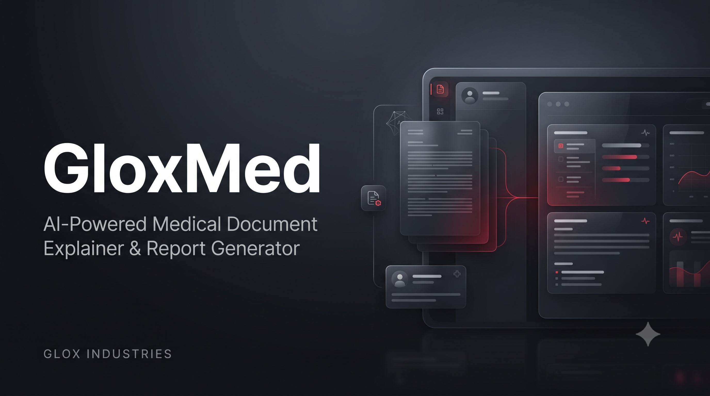

<p align="center">
  
</p>

<h1 align="center">🩺 GloxMed</h1>

<p align="center">
  <strong>AI-Powered Medical Document Explainer & Report Generator</strong>
</p>

<p align="center">
  <em>Understand medical documents. Organize patient information. Communicate clearly.</em>
</p>

<p align="center">


</p>

---

## ⚠️ Important Warning

> **GloxMed is an educational and informational software project.**
>
> It is intended for **education, teaching, learning, experimentation, and general user understanding of medical documents**.
>
> GloxMed is **NOT a medical diagnostic tool**, does not replace a doctor or other qualified healthcare professional, and should not be used to make medical decisions.
>
> Always consult a qualified healthcare professional for diagnosis, treatment, medication, or other medical decisions.

---

## 📖 About

**GloxMed** is a desktop application developed by **Glox Industries** that helps users understand complex medical documents by converting extracted medical information into clearer, structured explanations.

The application supports multiple patient profiles, medical document processing, patient context, AI-powered explanations, and automatic generation of doctor-ready reports.

GloxMed is designed to make medical information easier to organize, understand, and communicate while keeping the final interpretation and medical decisions with qualified healthcare professionals.

---

## ✨ Features

| Feature                              | Description                                                                                       |
| ------------------------------------ | ------------------------------------------------------------------------------------------------- |
| 👤 **Multiple Profiles**             | Create and manage multiple patient profiles with personal and medical context.                    |
| 📄 **PDF Support**                   | Extract text from PDF medical documents for processing.                                           |
| 📝 **DOCX Support**                  | Process supported Microsoft Word medical documents.                                               |
| 🤖 **AI Explanation**                | Convert complex medical information into easier-to-understand language.                           |
| 🩺 **Doctor-Focused Reports**        | Generate structured information that can help healthcare professionals quickly review a document. |
| 🔎 **Missing Information Detection** | Highlights information that may be unclear, incomplete, or require further clarification.         |
| 📋 **Patient Context**               | Combine document information with symptoms, profile details, and additional instructions.         |
| 📑 **MediNote**                      | Generate a simplified explanation of the source medical document.                                 |
| 📊 **MediReport**                    | Generate a structured patient-focused report for discussion with healthcare professionals.        |
| 🔢 **Automatic Report Numbering**    | Generated reports are automatically organized and numbered.                                       |
| 💾 **Local Storage**                 | Patient profiles and generated reports are stored locally on the user's computer.                 |
| 🧠 **Multiple AI Models**            | Automatically detect available free models through OpenRouter.                                    |
| 🔑 **Simple API Setup**              | Add an OpenRouter API key directly through the application.                                       |
| 🖥️ **Desktop Application**          | Runs as a standalone Windows desktop application.                                                 |
| 🎨 **Modern UI**                     | Custom dark-themed interface built with PySide6.                                                  |
| 🆓 **Free & Open Source**            | Available under the MIT License.                                                                  |

---

## 🚀 Download

Want to use the ready-to-run version?

### 👉 [Download GloxMed](DOWNLOAD.md)

The download guide contains the available releases and instructions for running GloxMed.

---

## 🛠️ Technology Stack

| Technology         | Purpose                               |
| ------------------ | ------------------------------------- |
| **Python**         | Core application development          |
| **PySide6**        | Desktop graphical user interface      |
| **PyMuPDF**        | PDF text extraction                   |
| **python-docx**    | DOCX document processing              |
| **ReportLab**      | PDF report generation                 |
| **OpenRouter API** | AI model connectivity                 |
| **python-dotenv**  | Environment and API key configuration |
| **PyInstaller**    | Windows executable packaging          |

---

## 🔄 How GloxMed Works

```text
Medical Document
       │
       ▼
PDF / DOCX Text Extraction
       │
       ▼
Patient Profile + Symptoms + Context
       │
       ▼
Selected AI Model
       │
       ▼
Structured Medical Explanation
       │
       ├───────────────┐
       ▼               ▼
   MediNote        MediReport
       │               │
       └───────┬───────┘
               ▼
        Local PDF Storage
```

---

## 🔐 Privacy & Data Handling

GloxMed is designed as a **local desktop application**.

Patient profiles and generated reports are stored locally on the user's computer rather than being hosted by GloxMed on a web server.

Medical documents are processed locally for text extraction. The extracted information, along with any context provided by the user, may be sent to the **AI model selected through OpenRouter** for processing.

> Users should understand the privacy policies and data handling practices of any external AI service they choose to use.

GloxMed itself does not operate a hosted database for storing patient profiles.

---

## 🤖 AI Model Support

GloxMed uses **OpenRouter** to provide access to AI models.

Instead of being permanently tied to a single model, GloxMed can detect available models and allow the user to select an available free model.

This makes the application flexible as available models change over time.

---

## 📑 Generated Reports

### MediNote

A simplified explanation of the uploaded medical document.

Designed to help users understand:

* Important findings
* Medical terminology
* Doctor instructions
* Relevant information from the document
* Points that may require clarification

### MediReport

A more structured report containing:

* Patient profile
* Patient-reported symptoms
* Document information
* Important findings
* Information requiring clarification
* Potential points to discuss with a healthcare professional
* Safety and informational notes

Reports are automatically saved to:

```text
GloxMed_Reports/
```

---

## 📂 Supported Documents

Currently supported:

* `.pdf`
* `.docx`

> Image-only or scanned PDFs may require OCR before their text can be processed.

---

## 🧑‍💻 Running From Source

Clone the repository:

```bash
git clone https://github.com/AvgLucer/GloxMed.git
cd GloxMed
```

Install the required dependencies:

```bash
pip install -r requirements.txt
```

Run the application:

```bash
python gloxmed.py
```

---

## 📦 Building the Windows EXE

GloxMed can be packaged into a single Windows executable using PyInstaller:

```bash
pyinstaller --onefile --windowed --name GloxMed gloxmed.py
```

The generated executable will be available inside:

```text
dist/GloxMed.exe
```

---

## 🏢 About Glox Industries

**GloxMed** is an independent software project created under **Glox Industries**.

Glox Industries focuses on building useful, creative, and modern software with the philosophy:

> **Building Softwares With a New Vision**

GloxMed is a standalone application and is **not part of the Glox Widgets collection**.

---

## 👨‍💻 Credits

**Built By**

### AvgLucer | Gaurav W

**Founder & CEO — Glox Industries**

---

## 🔗 Links

| Platform        | Link                                    |
| --------------- | --------------------------------------- |
| 🐙 **GitHub**   | https://github.com/AvgLucer             |
| 💼 **LinkedIn** | https://www.linkedin.com/in/glox-gaurav |
| ▶️ **YouTube**  | https://www.youtube.com/@GloxIndustries |

---

## 📜 License

GloxMed is released under the **MIT License**.

You are free to use, modify, distribute, and build upon the project according to the terms of the license.

However:

> **Do not claim the original GloxMed project or its original work as your own.**

The original authorship and copyright notices must be preserved according to the MIT License.

See [`LICENSE`](LICENSE) for the complete license text.

---

## 🌟 Support GloxMed

If you find GloxMed useful:

⭐ Star the repository
🐛 Report issues
💡 Suggest improvements
🔧 Contribute to the project
📢 Share it with others

Every contribution helps Glox Industries continue building new software.

---

<p align="center">

# ⚡ GLOX INDUSTRIES

### BUILDING SOFTWARES WITH A NEW VISION.

**Built By: AvgLucer | Gaurav W**
**Founder & CEO — Glox Industries**

</p>
